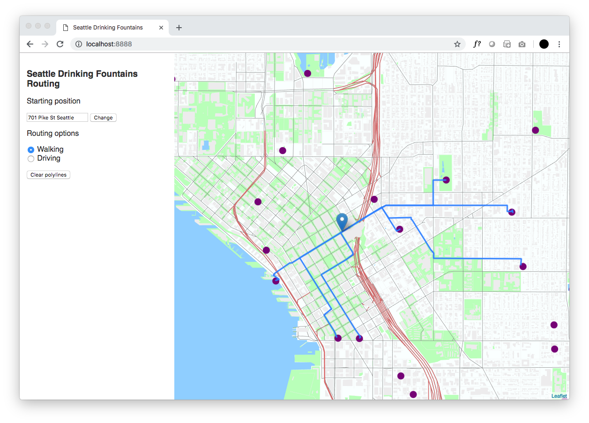
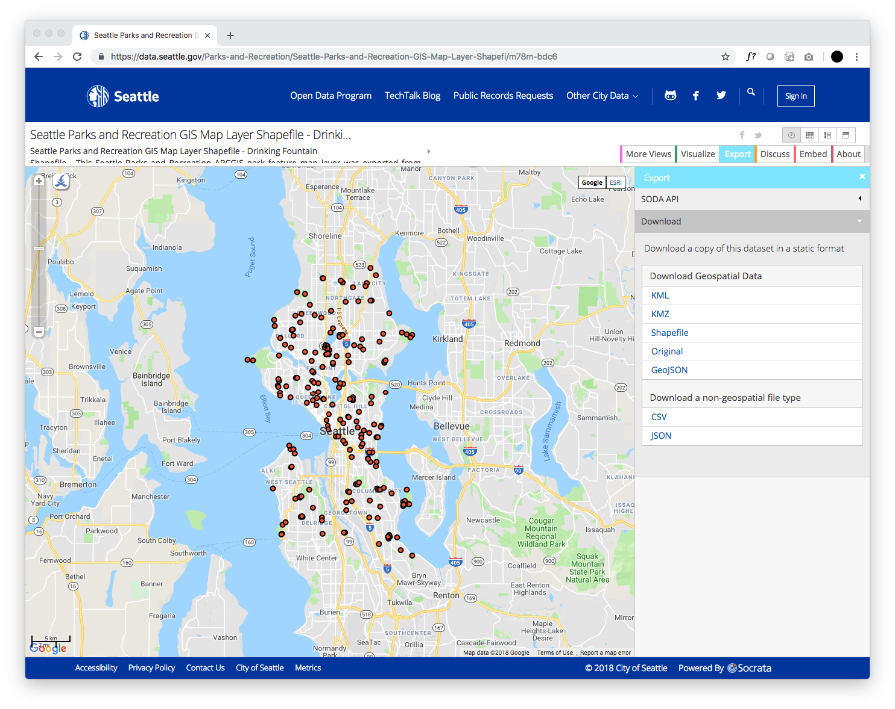
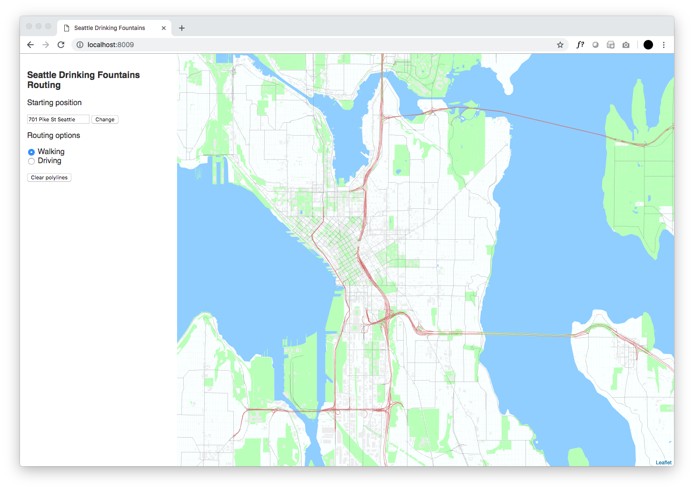
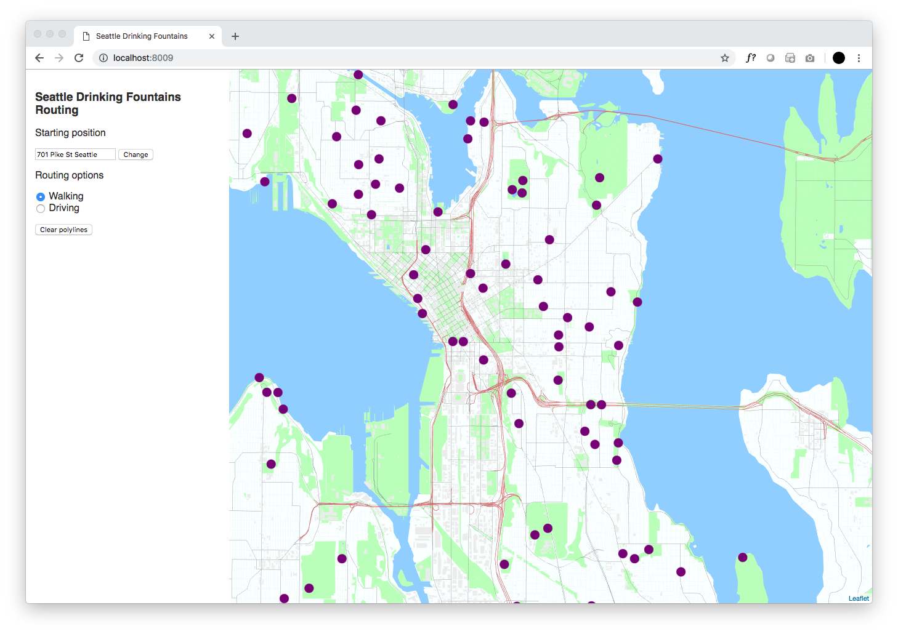

# Use HERE Location Services Routing to navigate to features in an XYZ Space


## Introduction

*Duration is 3 min*

This codelab will walk you through combining HERE XYZ and HERE Location Services to create an interactive routing application. Using a public data source of [drinking fountains in Seattle](https://data.seattle.gov/Parks-and-Recreation/Seattle-Parks-and-Recreation-GIS-Map-Layer-Shapefi/m78m-bdc6) the user of the application will be able visualize the path from a specified starting location to a drinking fountain location. The drinking fountain dataset will be stored in an XYZ Space.

The result of this tutorial will be an interactive map application rendered with [Leaflet](https://leafletjs.com/) and [Tangram](https://github.com/tangrams/tangram).



This codelab demonstrates the use of multiple HERE products:
* [HERE Location Services Geocoder API](https://developer.here.com/documentation/geocoder/topics/quick-start-geocode.html)
* [HERE Location Services Places API](https://developer.here.com/documentation/places/topics/quick-start-find-text-string.html)
* [HERE XYZ Spaces](https://www.here.xyz/)

### __What is the Geocoder API?__

The Geocoder REST API enables developers to convert street addresses to geo-coordinates and vice-versa with forward geocoding, including landmarks, and reverse geocoding.

The HERE Geocoder API is a REST API that allows you to:

* Obtain coordinates for addresses
* Obtain addresses or administrative areas for locations
* Obtain coordinates for known landmarks.

### __What is the Places API?__

The Places (Search) API is a REST API that allows you to build applications where users can search for places and receive detailed information about selected places.

### __What is a HERE XYZ Space?__

HERE XYZ is an open, interoperable and real-time location data management service from HERE Technologies that offers simple APIs, SDKs, components, and interactive tools that enable everyone to make maps easier and faster.

### __What you'll need__

* a [HERE Developer](https://developer.here.com/) account for leveraging location APIs


## Grabbing data from the open data website

*Duration is 3 min*

To get started, download the [Seattle Drinking Fountain dataset](https://data.seattle.gov/Parks-and-Recreation/Seattle-Parks-and-Recreation-GIS-Map-Layer-Shapefi/m78m-bdc6) from Seattle's Open Data Website.

Click on the export button in the top right, and then *GeoJSON* link:



Move the file into your project's directory. For convenience, I renamed the file `fountains.geojson`

## Uploading data from an XYZ Space

*Duration is 12 min*

The first task we'll accomplish is uploading the data to an XYZ Space. XYZ Spaces are powerful geospatial databases that can store millions of rows. A great benefit about XYZ Spaces, is that they automatically tile the data; meaning that the data can be query efficiently for map display.

For more information about XYZ Spaces, take a look at the [documentation](https://www.here.xyz/api/).

There are many ways to upload data to an XYZ Space:

- via REST API
- via [XYZ Studio](https://xyz.here.com/)
- via the [HERE Command Line Interface](https://www.here.xyz/cli/) (CLI)

I prefer the CLI because of its ease of use. To install the CLI, run the command:
```
npm install -g @here/cli
```
Next, configure your credentials by running:
```
here configure set
```
When prompted, enter your app id/code from the HERE Developer Portal.

The next step is to create a new XYZ Space with the following command:
```
here xyz create -t "Seattle Drinking Fountains" -d "Locations of drinking fountains throughout Seattle"
```
The `-t` and `-d` options are for the space's title and description.

Upon completion, the  `here xyz create` command will a success message like:
```
xyzspace 'zgsrj7y4' created successfully
```
Be sure, to copy the id in quotations--we'll be using this in a future step.

To upload the data to the space, use the following command:
```
here xyz upload YOUR_SPACE_ID -f foundatins.geojson
```
Be sure to replace `YOUR_SPACE_ID` with the space id that was outputted when you created the space with the `here xyz create` command.

Now is also a good time to grab your XYZ token. To see your available tokens, run the following command:
```
here xyz token
```
Keep one of these tokens handy--we'll be using it in future steps.

Congrats! We've now created a new XYZ Space and uploaded data. To verify you've successfully created the space, you can run the following command:
```
here xyz show YOUR_SPACE_ID -w
```
This command will open up the space in the [HERE XYZ GeoJSON viewer](http://geojson.tools/).

## Setting up HTML, JavaScript and CSS skeleton

So far we've uploaded data to our XYZ Space, now let's begin creating our web application skeleton.

Create a new `index.html` file with the following code:
```html
<html>
<head>
   <title>Seattle Drinking Fountains</title>
   <link rel="stylesheet" href="style.css">
   <script src="https://unpkg.com/leaflet@1.0.1/dist/leaflet.js"></script>
   <script src="https://unpkg.com/tangram/dist/tangram.min.js"></script>
   <script src="polyline-animation.js"></script>
   <link rel="stylesheet" href="https://unpkg.com/leaflet@1.0.1/dist/leaflet.css" />
</head>

<body>
   <div id="control">
      <h3>Seattle Drinking Fountains Routing</h3>
      <p>
         Starting position
      </p>
      <input type="text" value="701 Pike St Seattle" id="start" />
      <button id="change-start">Change</button>
      <p>
         Routing options
      </p>
      <form id="routing-mode" action="">
         <input type="radio" name="routing-mode" id="walking" value="pedestrian" checked> Walking<br>
         <input type="radio" name="routing-mode" id="driving" value="car"> Driving
      </form>
      <button id="clear">Clear polylines</button>
   </div>
   <div id="map"></div>
   <script src="index.js" type="text/javascript"></script>s
</body>
</html>
```
In the above code, we have laid out the template for:
* a map, with the div of id `map`
* a control sidebar, with the id `control`. The sidebar is where we can configure options for the routing and map view.

Additionally, be sure to download the file [`polyline-animation.js`](polyline-animation.js). This file will animation the polylines on the map during routing.

As for the CSS, create a new file titled `style.css` with the following code:
```css
body {
   margin: 0px;
   border: 0px;
   padding: 0px;
   font-family: sans-serif;
   color: #333;
}

#map {
   height: 100%;
   width: 100%;
   position: absolute;
}

#control {
   width: 300px;
   height: 100%;
   position: absolute;
   top: 0;
   left: 0;
   background-color: white;
   z-index: 1000;
   padding: 15px;
}
```

Last but not least, create a file titled `index.js` with the following code:
```js
const here = {
   id: 'HERE-APP-ID',
   code: 'HERE-APP-CODE'
};

const map = L.map('map', {
   center: [47.608013, -122.335167],
   zoom: 13,
   layers: [
      Tangram.leafletLayer({
         scene: 'scene.yaml',
         events: {
            click: onMapClick
         }
      })
   ],
   zoomControl: false
});

async function onMapClick() {

}
```

The above code initiates the Leaflet map with a Tangram vector layer. Don't try to run the project yet--it is still missing some components.

Additionally, be sure replace `HERE-APP-ID` and `HERE-APP-CODE` with your own credentials obtained on the [HERE Developer Portal](https://developer.here.com)

At this point, you should have created four files in your project directory:
* `index.html`
* `index.js`
* `style.css`
* `polyline-animation.js`

## Configuring the Tangram layer

*Duration is 5 min*

So far, we've uploaded data to the XYZ Space and carved out our web application's basic code skeleton. In this section, we'll focus on getting getting our Leaflet/Tangram map up and running.

Go ahead and create a new file `scene.yaml`. A YAML scene file is a file Tangram uses to interpret map styling rules. In this file, we'll be configuring styling rules that not only style cartography objects like parks, roads and builings, but also our very own drinking fountain data.

Go ahead and paste the following into the `scene.yaml` file:
```yaml
cameras:
    camera1:
        type: perspective

lights:
    light1:
        type: directional
        direction: [0, 1, -.5]
        diffuse: .3
        ambient: 1

sources:
    mapzen:
        type: TopoJSON
        url: https://tile.nextzen.org/tilezen/vector/v1/all/{z}/{x}/{y}.topojson
        url_params:
            api_key: 3XqXMjEdT2StnrIRJ4HYbg
        max_zoom: 16

layers:
    earth:
        data: { source: mapzen }
        draw:
            polygons:
                order: function() { return feature.sort_rank; }
                color: '#ddeeee'

    landuse:
        data: { source: mapzen }
        draw:
            polygons:
                order: function() { return feature.sort_rank; }
                color: '#aaffaa'

    water:
        data: { source: mapzen }
        draw:
            polygons:
                order: function() { return feature.sort_rank; }
                color: '#88bbee'

    roads:
        data: { source: mapzen }
        filter:
            not: { kind: [path, rail, ferry] }
        draw:
            lines:
                order: function() { return feature.sort_rank; }
                color: gray
                width: 8
                cap: round
        highway:
            filter:
                kind: highway
            draw:
                lines:
                    order: function() { return feature.sort_rank; }
                    color: '#cc6666'
                    width: 12
                    outline:
                        color: grey
                        width: 1.5
        minor_road:
            filter:
                kind: minor_road
            draw:
                lines:
                    order: function() { return feature.sort_rank; }
                    color: lightgrey
                    width: 5

    buildings:
        data: { source: mapzen }
        draw:
            polygons:
                order: function() { return feature.sort_rank; }
                color: lightgrey
        3d-buildings:
            filter: { $zoom: { min: 15 } }
            draw:
                polygons:
                    extrude: function () { return feature.height > 20 || $zoom >= 16; }
```

Quick checkpoint: let's open up the index.html file and take a peak at the application. If all goes well, you should be seeing the following:



## Adding drinking fountain data to the map

*Duration is 5 min*

Now that the map is configured, let's add the drinking fountain data to it from the XYZ Space.

To do this, we'll be adding a new source and layer to Tangram's `scene.yaml` file, just like we would do with any other cartography feature.

Inside of `sources:`, add the following:
```yaml
fountains:
     url: https://xyz.api.here.com/hub/spaces/XYZ-SPACE-ID/tile/web/{z}_{x}_{y}
     type: GeoJSON
     url_params:
         access_token: XYZ-TOKEN
```
Be sure to replace `XYZ-SPACE-ID` and `XYZ-TOKEN` with your space's ID and your account's token, respectively. Remember, you can find your account's token by running `here xyz token` in the command line.

Next, inside of `layers:`, add the following:
```yaml
fountains:
    data: {source: fountains}
    draw:
        points:
            color: purple
            size: 15px
            interactive: true
```

First, we added the data source inside of the `sources` section. Then, we configured the fountains dataset as a layer inside of `layers`. Ensure that `interactive` is set to `true`. This will be important when we try to interact with the data inside on the map.

Now, let's take a look back at our map. Refresh the page and you should see the map populated with purple markers!



## Adding geocoding capabilities to the map

In our application's interface, we enable the user to input a starting location for the routing to a drinking fountain. The input takes in addresses, which is easy for us humans to understand. However, maps and services built on top of maps require coordinates instead of addresses. In order to transform addresses to coordinates, we must geocode them. Luckily, HERE has a REST service to do exactly that.

Add the following to `index.js`:
```js
async function geocode(query) {
   const url = `https://geocoder.api.here.com/6.2/geocode.json?app_id=${here.id}&app_code=${here.code}&searchtext=${query}`
   const response = await fetch(url);
   const data = await response.json();
   return await data.Response.View[0].Result[0].Location.NavigationPosition[0];
}
```
The function `geocode()` takes in a parameter, `query`, and pumps it through the HERE Geocoder API, and then returns a latitude and longitude object in the form of:
```js
{
   Latitude: Number,
   Longitude: Number
}
```

## Adding routing capabilities to the map

*Duration is 5 min*

We now have two points:
* the starting location specified by the user in the input form (and then geocoded)
* the location of a particular drinking fountain in the XYZ Space (the user will click on this)

This means we can move on to the routing function. Add the following method to `index.js`:
```js
async function route(start, end) {
   const mode = document.querySelector('input[name="routing-mode"]:checked').value;
   const url = `https://route.api.here.com/routing/7.2/calculateroute.json?app_id=${here.id}&app_code=${here.code}&waypoint0=geo!${start}&waypoint1=geo!${end}&mode=fastest;${mode};traffic:disabled&routeattributes=shape`;
   const response = await fetch(url);
   const data = await response.json();
   return await data.response.route[0];
}
```

This function takes in two sets of coordinates (start and end) and returns an object with routing information. Since we would like shape information of the route, we added on `&routeattributes=shape` onto our request URL. For additional routing features and parameters, be sure to check out the Routing API [documentation](https://developer.here.com/documentation/routing/topics/request-constructing.html).

## Putting it all together

*Duration is 10 min*

Now that we have our map, geocoding function, and routing function complete, let's start tying it all together with some interactivity.

Insert the following near the top in `index.js`:
```js
let startCoordinates = '';

document.getElementById('clear').onclick = clearMap;
document.getElementById('change-start').onclick = addStartingMarker;
addStartingMarker();
```

The variable `startCoordinates` will be the variable storing the coordinates of the starting position of the route. This variable can be updated by the user through the input form. This variable is currently an empty string, but will be assigned once `addStartingMarker()` is called upon map load.

Again, insert some additional code in `index.js`:
```js
async function addStartingMarker() {
   clearMap();
   const startAddress = document.getElementById('start').value;
   startCoordinates = await geocode(startAddress);
   const startingCircle = L.marker([startCoordinates.Latitude, startCoordinates.Longitude], {alt: 'start'}).addTo(map);
}

function clearMap() {
   map.eachLayer((layer) => {
      if (!layer.hasOwnProperty('_updating_tangram') && !layer.options.hasOwnProperty('alt')) {
         map.removeLayer(layer);
      }
   });
}
```
`addStartingMarker()` is a function to add the starting marker to the map. Anytime the change button next to the input form is clicked, this function will update the marker's position. This function also calls geocoding function to translate the input form's address to coordinates.

`clearMap()` is a helper function for clearing lines on the map. This function is executed when the *Clear polyline* button is clicked by the user. This function will only clear out polylines from the map; the starting marker and the Tangram layer will not be removed from the map.


Finally, add the last block of code to `index.js`:
```js
async function onMapClick(selection) {
   if (selection.feature) {
      const endCoordinates = `${selection.leaflet_event.latlng.lat},${selection.leaflet_event.latlng.lng}`;
      const routeData = await route(`${startCoordinates.Latitude},${startCoordinates.Longitude}`, endCoordinates);
      const shape = routeData.shape.map(x => x.split(","));
      const poly = L.polyline(shape).addTo(map).snakeIn();
   }
}
```

## Summary

*Duration is 2 min*

Congratulations! You've completed this tutorial.

Your final result should look like:


In this tutorial, you've learned how to:

* create XYZ Spaces and upload data with the HERE command line interface.
* transform addresses to coordinates with the HERE Geocoding API.
* create routing requests with the HERE Routing API.
* develop interactive mapping applications with Leaflet and Tangram.
* and navigate to nearby Seattle drinking fountains!

This is just a basic example of what can be done with HERE Location Services and XYZ, take a look at the HERE Developer blog to see more examples of creative and useful applications of HERE Location Services and XYZ.

## Appendix: full code samples

### `index.html`

```html
<html lang="en-us">

<head>
   <meta charset="utf-8">
   <meta http-equiv="Content-Type" content="text/html; charset=utf-8">
   <meta name="viewport" content="width=device-width, initial-scale=1.0, maximum-scale=1.0, user-scalable=no">
   <title>Seattle Drinking Fountains</title>

   <link rel="stylesheet" href="style.css">

   <script src="https://unpkg.com/leaflet@1.0.1/dist/leaflet.js"></script>
   <script src="https://unpkg.com/tangram/dist/tangram.min.js"></script>
   <script src="polyline-animation.js"></script>
   <link rel="stylesheet" href="https://unpkg.com/leaflet@1.0.1/dist/leaflet.css" />
</head>

<body>
   <div id="control">
      <h3>Seattle Drinking Fountains Routing</h3>
      <p>
         Starting position
      </p>
      <input type="text" value="701 Pike St Seattle" id="start" />
      <button id="change-start">Change</button>
      <p>
         Routing options
      </p>
      <form id="routing-mode" action="">
         <input type="radio" name="routing-mode" id="walking" value="pedestrian" checked> Walking<br>
         <input type="radio" name="routing-mode" id="driving" value="car"> Driving
      </form>
      <button id="clear">Clear polylines</button>
   </div>
   <div id="map"></div>
   <script src="index.js" type="text/javascript"></script>s
</body>

</html>
```

### `index.js`
```js

const here = {
   id: 'HERE-APP-ID',
   code: 'HERE-APP-CODE'
};

const map = L.map('map', {
   center: [47.608013, -122.335167],
   zoom: 13,
   layers: [
      Tangram.leafletLayer({
         scene: 'scene.yaml',
         events: {
            click: onMapClick
         }
      })
   ],
   zoomControl: false
});

let startCoordinates = '';

document.getElementById('clear').onclick = clearMap;
document.getElementById('change-start').onclick = addStartingMarker;
addStartingMarker();

async function geocode(query) {
   const url = `https://geocoder.api.here.com/6.2/geocode.json?app_id=${here.id}&app_code=${here.code}&searchtext=${query}`
   const response = await fetch(url);
   const data = await response.json();
   return await data.Response.View[0].Result[0].Location.NavigationPosition[0];
}

async function route(start, end) {
   const mode = document.querySelector('input[name="routing-mode"]:checked').value;
   const url = `https://route.api.here.com/routing/7.2/calculateroute.json?app_id=${here.id}&app_code=${here.code}&waypoint0=geo!${start}&waypoint1=geo!${end}&mode=fastest;${mode};traffic:disabled&routeattributes=shape`
   const response = await fetch(url);
   const data = await response.json();
   return await data.response.route[0];
}

function clearMap() {
   map.eachLayer((layer) => {
      if (!layer.hasOwnProperty('_updating_tangram') && !layer.options.hasOwnProperty('alt')) {
         map.removeLayer(layer);
      }
   });
}

async function addStartingMarker() {
   clearMap();
   const startAddress = document.getElementById('start').value;
   startCoordinates = await geocode(startAddress);
   const startingCircle = L.marker([startCoordinates.Latitude, startCoordinates.Longitude], {alt: 'start'}).addTo(map);
}

async function onMapClick(selection) {
   if (selection.feature) {
      const endCoordinates = `${selection.leaflet_event.latlng.lat},${selection.leaflet_event.latlng.lng}`;
      const routeData = await route(`${startCoordinates.Latitude},${startCoordinates.Longitude}`, endCoordinates);
      const shape = routeData.shape.map(x => x.split(","));
      const poly = L.polyline(shape).addTo(map).snakeIn();
   }
}
```

### `scene.yaml`
```yaml
cameras:
    camera1:
        type: perspective

lights:
    light1:
        type: directional
        direction: [0, 1, -.5]
        diffuse: .3
        ambient: 1

sources:
    mapzen:
        type: TopoJSON
        url: https://tile.nextzen.org/tilezen/vector/v1/all/{z}/{x}/{y}.topojson
        url_params:
            api_key: 3XqXMjEdT2StnrIRJ4HYbg
        max_zoom: 16
    offices:
        url: https://xyz.api.here.com/hub/spaces/XYZ-SPACE-ID/tile/web/{z}_{x}_{y}
        type: GeoJSON
        url_params:
            access_token: XYZ-TOKEN

layers:
    offices:
        data: {source: offices}
        draw:
            points:
                color: purple
                size: 15px
                interactive: true
    earth:
        data: { source: mapzen }
        draw:
            polygons:
                order: function() { return feature.sort_rank; }
                color: '#ddeeee'

    landuse:
        data: { source: mapzen }
        draw:
            polygons:
                order: function() { return feature.sort_rank; }
                color: '#aaffaa'

    water:
        data: { source: mapzen }
        draw:
            polygons:
                order: function() { return feature.sort_rank; }
                color: '#88bbee'

    roads:
        data: { source: mapzen }
        filter:
            not: { kind: [path, rail, ferry] }
        draw:
            lines:
                order: function() { return feature.sort_rank; }
                color: gray
                width: 8
                cap: round
        highway:
            filter:
                kind: highway
            draw:
                lines:
                    order: function() { return feature.sort_rank; }
                    color: '#cc6666'
                    width: 12
                    outline:
                        color: grey
                        width: 1.5
        minor_road:
            filter:
                kind: minor_road
            draw:
                lines:
                    order: function() { return feature.sort_rank; }
                    color: lightgrey
                    width: 5

    buildings:
        data: { source: mapzen }
        draw:
            polygons:
                order: function() { return feature.sort_rank; }
                color: lightgrey
        3d-buildings:
            filter: { $zoom: { min: 15 } }
            draw:
                polygons:
                    extrude: function () { return feature.height > 20 || $zoom >= 16; }
```

### `style.css`
```css
body {
   margin: 0px;
   border: 0px;
   padding: 0px;
   font-family: sans-serif;
   color: #333;
}

#map {
   height: 100%;
   width: 100%;
   position: absolute;
}

#control {
   width: 300px;
   height: 100%;
   position: absolute;
   top: 0;
   left: 0;
   background-color: white;
   z-index: 1000;
   padding: 15px;
}
```
